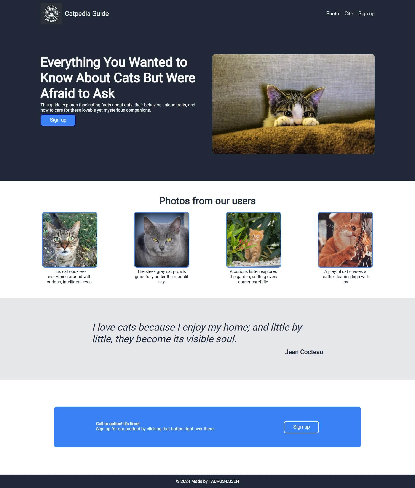

# ErsteLanding
**Landing Page Project** | The Odin Project

This project demonstrates the creation of a responsive landing page as part of [The Odin Project](https://www.theodinproject.com/lessons/foundations-landing-page). The goal was to practice essential web development skills, including **HTML5** structure and **CSS3** styling with **Flexbox** for layout alignment.

## Features
- Fully responsive design
- Clean and semantic HTML structure
- Styled using modern CSS techniques
- Focused on usability and aesthetics

## Preview

## Live Version
You can view the live version of this project here:  
[**ErsteLanding - Live Preview**](https://TAURUS-ESSEN.github.io/ErsteLanding/index.html)

## Technologies Used
- **HTML5** for semantic and structured content
- **CSS3 (Flexbox)** for a modern and adaptable layout design
